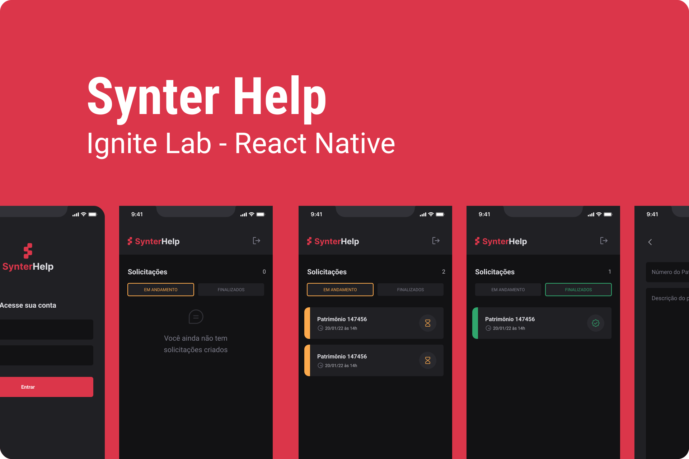

    <h1 align="center">
        
        &nbsp;
        Ignite Lab - React Native
         

<a aria-label="Completed" href="https://rocketseat.com.br/">
    </img>
</a>

    </h1>

 

  <a href="#speech_balloon-Sobre">Sobre</a>&nbsp;&nbsp;&nbsp;|&nbsp;&nbsp;&nbsp;
  <a href="#camera-Preview">Preview</a>&nbsp;&nbsp;&nbsp;|&nbsp;&nbsp;&nbsp;
  <a href="#rocket-Tecnologias">Tecnologias</a>

## :speech_balloon: Sobre

A aplicação visa o cadastro de tarefas (solicitações) para serem realizadas. O App permite o cadastro de novas solicitações e a exibição das tasks cadastradas através de seu estado (”em andamento” ou “concluída”).

## :camera: Preview 

  

## :rocket: Tecnologias

- [Expo](https://expo.dev/)
    - [Expo bare workflow](https://docs.expo.dev/bare/exploring-bare-workflow/)
- [TypeScript](https://www.typescriptlang.org/)
- [NativeBase](https://nativebase.io/)
- [Phosphor Icons](https://phosphoricons.com/)

Feito com :red_heart:

